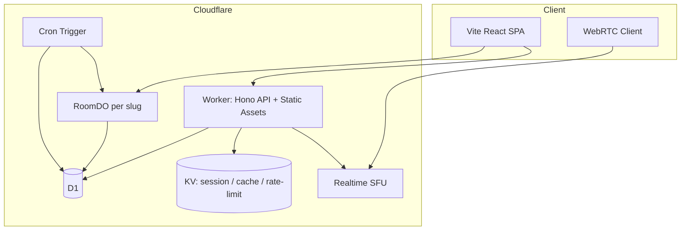

# fork — Cloudflare 無料枠 β版 設計書

> 作成日: 2026-07-11  
> 更新日: 2026-07-11  
> ステータス: Approved

## 1. 目的

音声ライブ配信 MVP「fork」を、**Cloudflare 無料枠のみ**で運用可能な β 版へ進化させる。

### 成功基準

| 指標 | 目標 |
|------|------|
| 同時視聴 | 1 ルームあたり最大 30 人（現状 README と同等） |
| 月間メディア転送 | Realtime SFU 無料枠 1,000 GB 以内 |
| API 可用性 | Workers 無料枠（10 万 req/日）内で運用 |
| DB | D1 無料枠（500 万 rows read/日、10 万 write/日）内 |
| 配信者 UX | 作成 → 配信 → 終了 → 再配信が同一 slug で可能 |
| 運用 | 管理者のみが `/admin/monitor` にアクセス可能 |

### スコープ外（β 以降）

- 映像配信・録画・VOD
- 課金・ギフト課金
- フォロー / 検索 / ランキング
- RealtimeKit（分課金・無料枠なし）

---

## 2. 現状と課題

### 現状スタック

```
Browser ──WebRTC──► LiveKit (自前 Docker)
       ──HTTP────► Next.js (Vercel 想定) + Prisma + SQLite
       ──SSE─────► 視聴者数ポーリング
```

### 主要課題（前回洗い出しより）

1. `hostIdentity` が配信終了後も残り、再配信・移譲不可
2. LiveKit 自前ホスト → Cloudflare 無料枠に含まれない
3. SSE + Presence 心拍 → D1 write 上限を容易に超過
4. 管理画面 RBAC なし
5. チャット非永続・モデレーション弱い
6. API レートリミットなし

---

## 3. アーキテクチャ案（3 択）

### 案 A: フル Cloudflare 移行（推奨）

```
Browser ──WebRTC──► Cloudflare Realtime SFU (+ TURN 内包)
       ──HTTP────► Workers (Hono) — API + OAuth + SFU トークン
       ──WS──────► Durable Objects (RoomDO: 視聴者数・チャット)
       ──Static──► Workers Static Assets (Vite + React SPA)
       ──SQL─────► D1
       ──Cache───► Workers KV (セッション・ルーム一覧・レートリミット)
       ──Cron────► Workers Cron (host 解放・KV warm)
```

| 長所 | 短所 |
|------|------|
| 無料枠内で完結 | Next.js / LiveKit / Prisma を全廃（破壊的変更） |
| 単一 Worker で API + 静的配信 | 既存 Playwright テストの書き換えが必要 |
| TURN 込みで NAT 越え | Drizzle + D1 へ ORM 移行 |

### 案 B: ハイブリッド（Next.js 温存）

Pages (OpenNext) + 既存 Next API を段階的に Workers へ移行。LiveKit は当面維持。

| 長所 | 短所 |
|------|------|
| 移行リスク低 | LiveKit ホストが CF 無料枠外（要件不一致） |
| 差分小 | Vercel + CF 二重運用 |

### 案 C: SFU のみ Cloudflare

API/DB は現状維持、メディアだけ Realtime SFU。

| 長所 | 短所 |
|------|------|
| メディア移行に集中 | 「インフラは CF 無料枠」要件を満たさない |

**推奨: 案 A** — ユーザー要件「インフラは Cloudflare 無料枠」に唯一適合。

---

## 4. ターゲットアーキテクチャ



### コンポーネント責務

| コンポーネント | 責務 |
|----------------|------|
| **Worker + Static Assets** | `/api/*` は Hono、`/*` は SPA fallback。同一オリジン |
| **Workers API (Hono)** | OAuth、ルーム CRUD、SFU セッション発行、BAN、リアクション集計 |
| **RoomDO** | ルーム単位の WebSocket（視聴者数 push）、直近チャット 200 件、ホスト online 状態 |
| **D1** | Room / Ban / ReactionAggregate（永続） |
| **KV** | 公開ルーム一覧キャッシュ（TTL 15s）、API レートリミット |
| **Realtime SFU** | 音声 publish/subscribe、DataChannel（リアクション broadcast） |
| **Cron** | 非アクティブ host 解放、古い Presence 削除、KV キャッシュ warm |

---

## 5. 無料枠バジェット

### Realtime SFU（1,000 GB/月）

音声 Opus 64 kbps、1 配信者 + 30 視聴者の場合:

- 下り（課金対象）≈ 30 × 64 kbps ≈ 1.92 Mbps
- 1 時間 ≈ 0.86 GB
- **月間 ≈ 1,160 時間**（1 ルーム常時 LITE 換算）

→ 数十人規模・複数ルーム短時間なら十分。常時大規模は不可（意図通り）。

### D1

| 操作 | 現状 MVP | 改善後 |
|------|----------|--------|
| Presence 心拍 | 20s ごと D1 upsert | **RoomDO メモリ + WS**（D1 不要） |
| ルーム一覧 | 毎回 D1 scan | **KV キャッシュ** + 更新時 invalidate |
| リアクション | 毎回 write | 維持（スパム対策で KV レートリミット） |

見込み: アクティブ 100 ユーザー規模でも D1 無料枠内。

### Workers + DO

| リソース | 無料枠 | 用途 |
|----------|--------|------|
| Workers requests | 100,000/日 | API + DO RPC |
| DO requests | 100,000/日 | Room WebSocket（20:1 課金比率） |
| DO duration | 13,000 GB-s/日 | **WebSocket Hibernation API 必須** |

---

## 6. データモデル（D1）

```sql
-- rooms
CREATE TABLE rooms (
  name TEXT PRIMARY KEY,
  display_name TEXT,
  host_identity TEXT,          -- NULL = 配信可能
  is_public INTEGER DEFAULT 1,
  host_last_seen_at TEXT,      -- ISO8601
  created_at TEXT DEFAULT (datetime('now'))
);

-- bans
CREATE TABLE bans (
  room_name TEXT NOT NULL,
  identity TEXT NOT NULL,
  created_at TEXT DEFAULT (datetime('now')),
  PRIMARY KEY (room_name, identity)
);

-- reaction_aggregates（個別 reaction 行は β では省略可）
CREATE TABLE reaction_aggregates (
  room_name TEXT NOT NULL,
  type TEXT NOT NULL,
  count INTEGER DEFAULT 0,
  PRIMARY KEY (room_name, type)
);

-- admin_users（RBAC）
CREATE TABLE admin_users (
  identity TEXT PRIMARY KEY
);
```

### host ライフサイクル

1. 配信開始: `host_identity = me`, `host_last_seen_at = now`
2. 配信中: RoomDO / Cron が `host_last_seen_at` を更新
3. 配信終了（明示退出 or SFU session 30s timeout）: **`host_identity = NULL`**
4. 再配信: 次の publish 要求者が host 取得

---

## 7. API 設計（Workers）

| Method | Path | 説明 |
|--------|------|------|
| GET | `/api/auth/:provider` | OAuth 開始 (Google/X) — Arctic |
| GET | `/api/auth/:provider/callback` | OAuth コールバック → KV セッション |
| POST | `/api/auth/logout` | セッション削除 |
| GET | `/api/auth/me` | 現在ユーザー |
| POST | `/api/room/create` | ルーム作成 |
| GET | `/api/room/list` | 公開ルーム（KV キャッシュ） |
| GET | `/api/room/info` | ルームメタ |
| POST | `/api/room/set-public` | 公開 toggle（host のみ） |
| POST | `/api/session` | SFU session + tracks 発行 |
| POST | `/api/reaction/send` | リアクション（レートリミット） |
| GET | `/api/reaction/summary` | 集計 |
| POST | `/api/moderation/ban` | BAN（host/admin） |
| WS | `/api/room/:slug/ws` | RoomDO WebSocket |

---

## 8. フェーズ分割

| Phase | 名称 | 成果物 |
|-------|------|--------|
| **0** | Cloudflare 基盤 | Wrangler プロジェクト、D1、Workers 骨格、CI |
| **1** | メディア移行 | LiveKit 除去、Realtime SFU 音声配信 |
| **2** | 状態管理刷新 | RoomDO、host 解放、WebSocket 視聴者数 |
| **3** | β 運用品質 | RBAC、レートリミット、共有リンク、テスト |
| **4** | 将来 | 映像、R2 録画、発見機能（別 spec） |

---

## 9. リスクと緩和

| リスク | 緩和 |
|--------|------|
| SFU API 複雑度 | 公式 example-architecture ベースの `sfu-client` モジュールに集約 |
| Next.js 全廃 | Vite SPA + Workers Static Assets。段階移行せず一括置換 |
| DO duration 課金 | Hibernation API + ping 間隔 30s |
| OAuth on Workers | Arctic + KV セッション + httpOnly Cookie |
| 帯域超過 | ルーム人数上限 30、管理画面で egress 概算表示 |

---

## 10. テスト方針

- **Unit**: Vitest + `@cloudflare/vitest-pool-workers`（Workers/DO）
- **E2E**: Playwright を Vite SPA + staging Worker 向けに書き直し（`app/e2e/`）
- **Load**: 30 仮想視聴者 WS 接続テスト（DO 上限確認）

---

## 11. 決定事項（2026-07-11 確定）

破壊的変更を許容し、Cloudflare 無料枠との相性を最優先して以下を確定する。

### 11.1 フロントエンド — Vite + React SPA（Next.js 全廃）

| 項目 | 決定 | 理由 |
|------|------|------|
| フレームワーク | **Vite 6 + React 19 + TypeScript** | ビルド成果物が静的ファイルのみ。Pages / Workers Static Assets に最適 |
| ルーティング | **TanStack Router** | 型安全。ファイルベースルートで `/`, `/room/$slug`, `/admin/monitor` |
| 状態管理 | React hooks のみ（β では Zustand 不導入） | YAGNI |
| 配置 | **Workers Static Assets**（`[assets]` binding） | API と SPA を同一 Worker・同一オリジン。CORS 不要 |
| 廃止 | `web/`（Next.js Pages Router）全体 | API Routes / NextAuth / Prisma / LiveKit SDK をすべて除去 |

```toml
# wrangler.toml（抜粋）
[assets]
directory = "./app/dist"
not_found_handling = "single-page-application"
binding = "ASSETS"
```

### 11.2 認証 — Arctic + KV セッション（Cloudflare Access は不採用）

| 項目 | 決定 | 理由 |
|------|------|------|
| OAuth ライブラリ | **[Arctic](https://arcticjs.dev/)** | Edge / Workers ネイティブ。Google・X (Twitter) 対応 |
| セッション保存 | **Workers KV** | D1 write を消費しない。TTL 付き自動失効 |
| Cookie | `__Host-fork-session`（httpOnly, Secure, SameSite=Lax） | セッション ID のみ。ペイロードは KV 参照 |
| 不採用 | Cloudflare Access | Zero Trust 向け。一般ユーザー向け Google/X ログインには不向き |
| 不採用 | Auth.js / NextAuth | Next.js 依存。Workers 単体ではオーバーヘッド大 |

**セッションフロー:**

```
1. GET /api/auth/google → Arctic redirect
2. GET /api/auth/google/callback → KV.put(sessionId, { userId, name, ... }, { expirationTtl: 604800 })
3. Set-Cookie: __Host-fork-session=<sessionId>
4. 以降 API は Cookie → KV lookup → identity 解決
```

### 11.3 ドメイン — β は `*.workers.dev` / `*.pages.dev`、カスタムドメインは任意

| 項目 | 決定 | 理由 |
|------|------|------|
| β 環境 | `fork-api.<account>.workers.dev` または Pages 自動 URL | 無料・即デプロイ。OAuth callback URL をここに設定 |
| 本番 | カスタムドメインは **Phase 3 以降**に Cloudflare DNS で追加 | β ブロッカーにしない |
| OAuth callback | デプロイ URL に合わせて Google/X コンソールを更新 | ドメイン確定後に再設定 |

### 11.4 その他の技術選定

| 領域 | 決定 |
|------|------|
| ORM | Drizzle ORM + D1 |
| HTTP フレームワーク | Hono |
| テスト (Worker) | Vitest + `@cloudflare/vitest-pool-workers` |
| テスト (UI) | Playwright（`app/e2e/` に新設） |
| モノレポ | npm workspaces: `app/`, `worker/`, `packages/db/` |
| CI | GitHub Actions → `wrangler deploy`（単一 Worker） |
