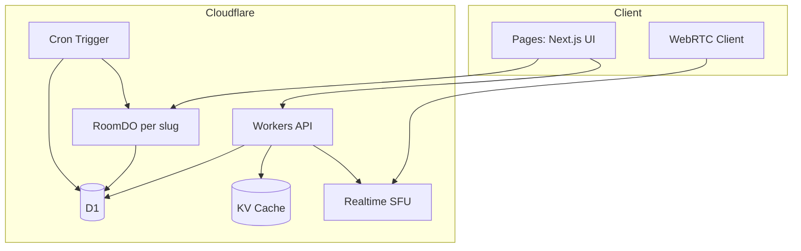

# fork — Cloudflare 無料枠 β版 設計書

> 作成日: 2026-07-11  
> ステータス: Draft（レビュー待ち）

## 1. 目的

音声ライブ配信 MVP「fork」を、**Cloudflare 無料枠のみ**で運用可能な β 版へ進化させる。

### 成功基準

| 指標 | 目標 |
|------|------|
| 同時視聴 | 1 ルームあたり最大 30 人（現状 README と同等） |
| 月間メディア転送 | Realtime SFU 無料枠 1,000 GB 以内 |
| API 可用性 | Workers 無料枠（10 万 req/日）内で運用 |
| DB | D1 無料枠（500 万 rows read/日、10 万 write/日）内 |
| 配信者 UX | 作成 → 配信 → 終了 → 再配信が同一 slug で可能 |
| 運用 | 管理者のみが `/admin/monitor` にアクセス可能 |

### スコープ外（β 以降）

- 映像配信・録画・VOD
- 課金・ギフト課金
- フォロー / 検索 / ランキング
- RealtimeKit（分課金・無料枠なし）

---

## 2. 現状と課題

### 現状スタック

```
Browser ──WebRTC──► LiveKit (自前 Docker)
       ──HTTP────► Next.js (Vercel 想定) + Prisma + SQLite
       ──SSE─────► 視聴者数ポーリング
```

### 主要課題（前回洗い出しより）

1. `hostIdentity` が配信終了後も残り、再配信・移譲不可
2. LiveKit 自前ホスト → Cloudflare 無料枠に含まれない
3. SSE + Presence 心拍 → D1 write 上限を容易に超過
4. 管理画面 RBAC なし
5. チャット非永続・モデレーション弱い
6. API レートリミットなし

---

## 3. アーキテクチャ案（3 択）

### 案 A: フル Cloudflare 移行（推奨）

```
Browser ──WebRTC──► Cloudflare Realtime SFU (+ TURN 内包)
       ──HTTP────► Workers (Hono)
       ──WS──────► Durable Objects (RoomDO: 視聴者数・チャット)
       ──Static──► Cloudflare Pages (Next.js via OpenNext)
       ──SQL─────► D1
       ──Cache───► Workers KV (ルーム一覧・レートリミット)
       ──Cron────► Workers Cron (Presence 整理・host 解放)
```

| 長所 | 短所 |
|------|------|
| 無料枠内で完結 | LiveKit → SFU へのクライアント/API 全面差し替え |
| グローバル edge | Next.js edge 移行の学習コスト |
| TURN 込みで NAT 越え | Prisma 不可 → Drizzle + D1 |

### 案 B: ハイブリッド（Next.js 温存）

Pages (OpenNext) + 既存 Next API を段階的に Workers へ移行。LiveKit は当面維持。

| 長所 | 短所 |
|------|------|
| 移行リスク低 | LiveKit ホストが CF 無料枠外（要件不一致） |
| 差分小 | Vercel + CF 二重運用 |

### 案 C: SFU のみ Cloudflare

API/DB は現状維持、メディアだけ Realtime SFU。

| 長所 | 短所 |
|------|------|
| メディア移行に集中 | 「インフラは CF 無料枠」要件を満たさない |

**推奨: 案 A** — ユーザー要件「インフラは Cloudflare 無料枠」に唯一適合。

---

## 4. ターゲットアーキテクチャ



### コンポーネント責務

| コンポーネント | 責務 |
|----------------|------|
| **Pages** | ロビー・ルーム UI。認証セッション Cookie |
| **Workers API** | OAuth、ルーム CRUD、SFU セッション発行、BAN、リアクション集計 |
| **RoomDO** | ルーム単位の WebSocket（視聴者数 push）、直近チャット 200 件、ホスト online 状態 |
| **D1** | Room / Ban / ReactionAggregate（永続） |
| **KV** | 公開ルーム一覧キャッシュ（TTL 15s）、API レートリミット |
| **Realtime SFU** | 音声 publish/subscribe、DataChannel（リアクション broadcast） |
| **Cron** | 非アクティブ host 解放、古い Presence 削除、KV キャッシュ warm |

---

## 5. 無料枠バジェット

### Realtime SFU（1,000 GB/月）

音声 Opus 64 kbps、1 配信者 + 30 視聴者の場合:

- 下り（課金対象）≈ 30 × 64 kbps ≈ 1.92 Mbps
- 1 時間 ≈ 0.86 GB
- **月間 ≈ 1,160 時間**（1 ルーム常時 LITE 換算）

→ 数十人規模・複数ルーム短時間なら十分。常時大規模は不可（意図通り）。

### D1

| 操作 | 現状 MVP | 改善後 |
|------|----------|--------|
| Presence 心拍 | 20s ごと D1 upsert | **RoomDO メモリ + WS**（D1 不要） |
| ルーム一覧 | 毎回 D1 scan | **KV キャッシュ** + 更新時 invalidate |
| リアクション | 毎回 write | 維持（スパム対策で KV レートリミット） |

見込み: アクティブ 100 ユーザー規模でも D1 無料枠内。

### Workers + DO

| リソース | 無料枠 | 用途 |
|----------|--------|------|
| Workers requests | 100,000/日 | API + DO RPC |
| DO requests | 100,000/日 | Room WebSocket（20:1 課金比率） |
| DO duration | 13,000 GB-s/日 | **WebSocket Hibernation API 必須** |

---

## 6. データモデル（D1）

```sql
-- rooms
CREATE TABLE rooms (
  name TEXT PRIMARY KEY,
  display_name TEXT,
  host_identity TEXT,          -- NULL = 配信可能
  is_public INTEGER DEFAULT 1,
  host_last_seen_at TEXT,      -- ISO8601
  created_at TEXT DEFAULT (datetime('now'))
);

-- bans
CREATE TABLE bans (
  room_name TEXT NOT NULL,
  identity TEXT NOT NULL,
  created_at TEXT DEFAULT (datetime('now')),
  PRIMARY KEY (room_name, identity)
);

-- reaction_aggregates（個別 reaction 行は β では省略可）
CREATE TABLE reaction_aggregates (
  room_name TEXT NOT NULL,
  type TEXT NOT NULL,
  count INTEGER DEFAULT 0,
  PRIMARY KEY (room_name, type)
);

-- admin_users（RBAC）
CREATE TABLE admin_users (
  identity TEXT PRIMARY KEY
);
```

### host ライフサイクル

1. 配信開始: `host_identity = me`, `host_last_seen_at = now`
2. 配信中: RoomDO / Cron が `host_last_seen_at` を更新
3. 配信終了（明示退出 or SFU session 30s timeout）: **`host_identity = NULL`**
4. 再配信: 次の publish 要求者が host 取得

---

## 7. API 設計（Workers）

| Method | Path | 説明 |
|--------|------|------|
| GET | `/api/auth/*` | OAuth (Google/X) via Auth.js |
| POST | `/api/room/create` | ルーム作成 |
| GET | `/api/room/list` | 公開ルーム（KV キャッシュ） |
| GET | `/api/room/info` | ルームメタ |
| POST | `/api/room/set-public` | 公開 toggle（host のみ） |
| POST | `/api/session` | SFU session + tracks 発行 |
| POST | `/api/reaction/send` | リアクション（レートリミット） |
| GET | `/api/reaction/summary` | 集計 |
| POST | `/api/moderation/ban` | BAN（host/admin） |
| WS | `/api/room/:slug/ws` | RoomDO WebSocket |

---

## 8. フェーズ分割

| Phase | 名称 | 成果物 |
|-------|------|--------|
| **0** | Cloudflare 基盤 | Wrangler プロジェクト、D1、Workers 骨格、CI |
| **1** | メディア移行 | LiveKit 除去、Realtime SFU 音声配信 |
| **2** | 状態管理刷新 | RoomDO、host 解放、WebSocket 視聴者数 |
| **3** | β 運用品質 | RBAC、レートリミット、共有リンク、テスト |
| **4** | 将来 | 映像、R2 録画、発見機能（別 spec） |

---

## 9. リスクと緩和

| リスク | 緩和 |
|--------|------|
| SFU API 複雑度 | 公式 example-architecture ベースの `sfu-client` モジュールに集約 |
| Next.js on CF 制限 | OpenNext adapter。API Routes は Workers へ移行 |
| DO duration 課金 | Hibernation API + ping 間隔 30s |
| OAuth on Workers | Auth.js `@auth/core` + D1 session store |
| 帯域超過 | ルーム人数上限 30、管理画面で egress 概算表示 |

---

## 10. テスト方針

- **Unit**: Vitest + `@cloudflare/vitest-pool-workers`（Workers/DO）
- **E2E**: 既存 Playwright を SFU mock / staging CF 環境向けに更新
- **Load**: 30 仮想視聴者 WS 接続テスト（DO 上限確認）

---

## 11. 未決事項（レビューで決定）

1. UI フレームワーク: Next.js (OpenNext) 維持 vs React SPA 化
2. 認証: Auth.js Workers vs Cloudflare Access（外部 IdP 限定）
3. カスタムドメイン: 必須かどうか

**デフォルト提案**: Next.js OpenNext 維持、Auth.js Workers、workers.dev → 後日 custom domain
